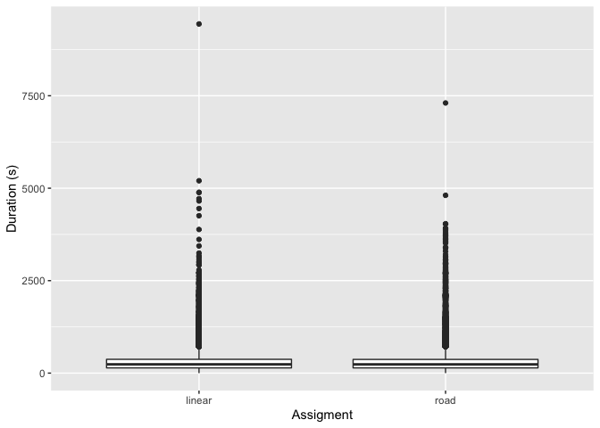
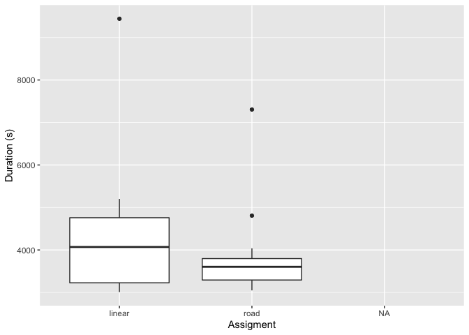
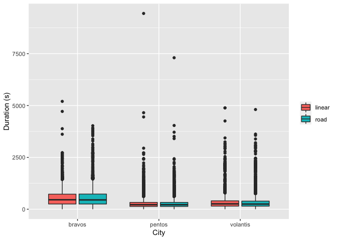
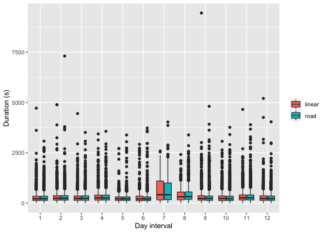

Data Science Challenge
================
Luis Carrasco Tornero
June 3, 2018

## Part 1: Experiment design

**AirBnB Professional photography: 1. Provide full details about how you
will run experiments to assess the impact of this service on both hosts
and guests. How will you ensure that the experiments are valid and not
biased?**

Two different approaches could be used to test whether professional
photography services are impacting the success of the properties.

1.  Experiment based on the comparison between properties using the
    services against those not using the service.

2.  Temporal comparison, analyzing the success increase (or not) of
    properties that adopted the professional photography but did not
    used it in the past.

For **experiment 1)**, data of both hosts and guests will be compiled.
Examples of the data compiled would be:

-   Host data: Number of visits, number of bookings, price/night/guest,
    city, location, property characteristics (number of bedrooms, bed
    size, etc.).

-   Guest data: Number of visits, type of booked host, time of each
    visit, rating of host description ‘accuracy’.

The ratio visits/booking would be compared between hosts with and
without photography service. Time of each visit for guests of hosts with
and without the service would be compared. Also the ratio of bookings
for hosts with and without service will be compared for similar type
hosts (see avoiding biases section). Comparison of the ‘accuracy’ rating
would be done. Stats: The analysis could be performed using tests for
equality of means.

**Experiment 2)** would analyze success changes of properties changing
from not using service to using one (and the opposite direction, if
there are cases). This experiment would analyze hosts (using the data of
experiment 1). The price of the property, the number of bookings per
unit of time, as well as the ratio visits/bookings will be compared from
before and after using the service. Increases in the price after
adopting the service would be especially useful. Stats: Step functions
(in comparison with continuous functions) and time-series analysis based
(i.e. change-point detection) methods could be used.

**Avoiding biases:** Comparison between photography service users and
not users is not trivial because the booking success is affected by many
variables, such as the price or quality of the property. In order to
avoid those biases, separate analysis controlling for those variables
are needed. This are a few examples of how to avoid this biases:

-   Use data only from 2015. The launch of identity verification, double
    blind reviews, increase of PR for AirBnB and the high quality of
    smart phones cameras could by decreasing the relative importance of
    the professional photography. Using data from before 2015 could give
    an overestimated value of the service.

-   Compare data for same price ranges: More expensive hosts could be
    more dependent on high quality photography, as people staying at
    pricey properties might be looking for beauty. Guests looking for
    cheaper properties might not be looking for pretty-looking
    properties but for convenient ones.

-   Compare data for similar locations: Very busy locations could be
    less influenced by the quality of the photography, as visitors look
    for cheaper deals no matter of the looks of the property. On the
    other hand, countryside locations could be relying on the looks.

-   Comparing by price and location might not be enough to avoid quality
    bias, as some properties might have better facilities. Number of
    rooms, bathrooms, room size or facilities could be compared. Some
    index could be built to compile all this characteristics into a
    ‘quality’ measure. The analysis should compare properties with
    similar quality.

Considering all these biases would be fundamental, as the results could
show that the best strategy might be to offer the service just to
expensive properties (the service is more important and the benefit for
AirBnB is bigger), or to properties located in the countryside.

## Part 2: Result analysis

*Pick-up time optimization challenge*

In order to the answer the questions proposed in the challenge: “should
the company move towards *road* distance?”, the main purpose of the data
analysis is to clarify whether or not the duration of the rides to pick
up the customers are shorter for the *road* vehicles than for the
*linear* vehicles.

To do that, the focus will be on the *going\_to\_pickup* data, and the
mean values for the duration of the trips will be analysed for different
parameters.

First, the data is extracted:

``` r
json_file <- "intervals_challenge.json"
data <- fromJSON(sprintf("[%s]",paste(readLines(json_file),collapse = ",")))
df_raw <- do.call(rbind.data.frame,data)
print(paste("Number of data elements = ",nrow(df_raw)*ncol(df_raw),sep=""))
```

    ## [1] "Number of data elements = 1156190"

The data contains more than a million elements. The size of the data
could represent slow computing times so some data cleansing is needed.
The purpose of the challenge is to evaluate whether the new *road*
assignment will reduce the pick up duration, so the other intervals data
are not needed. Other variables, such as distance or vehicles ids are
not needed for our analysis either.

``` r
# Subset to "going_to_pickup"
df_sub1 <- subset(df_raw,type=="going_to_pickup")
# Exclude non-used variables
vars <- names(df_sub1) %in% c("distance", "vehicle_id", "type")
df_sub <- df_sub1[!vars]
# Remove non-desired data
rm(data,df_raw,df_sub1)

print(paste("Number of data elements = ",nrow(df_sub)*ncol(df_sub),sep=""))
```

    ## [1] "Number of data elements = 234040"

Now the number of elements have been reduce more than 4 times.

The *trip\_id* needs to be reclassified into *road* and *linear* factors
in order to be analysed:

``` r
# Assign to "road"
df_sub$trip_id <-  gsub("^0\\w+|^1\\w+|^2\\w+|^3\\w+|^4\\w+|^5\\w+|^6\\w+|^7\\w+|^8\\w+", 
                        "road", df_sub$trip_id)
# Assign to "linear"
df_sub$trip_id <- gsub("^9\\w+|^a\\w+|^b\\w+|^c\\w+|^d\\w+|^e\\w+|^f\\w+", 
                        "linear", df_sub$trip_id)
```

Now we want to see how the data looks like without controlling for city,
time of the day, or ride duration range. To do that, boxplots for each
assignment (*road* and *linear*) showing the median and quartiles are
used:

``` r
p1 <- ggplot(aes(y = as.numeric(duration), x = as.factor(trip_id)), 
             data = df_sub) + geom_boxplot()
p1 + xlab("Assigment") + ylab("Duration (s)") 
```

    ## Warning in FUN(X[[i]], ...): NAs introduced by coercion

    ## Warning in FUN(X[[i]], ...): NAs introduced by coercion

    ## Warning: Removed 299 rows containing non-finite values (stat_boxplot).

<!-- -->

Median values look virtually identical. But to test whether *linear* and
*road* assignment is providing different duration, a statistical test is
needed. To choose the proper test to be used for our data, we need to
first test whether the data is normally distributed. A Shaphiro-Wilk
normality test for *duration* is used for each assignment:

``` r
# Shapiro-Wilk normality test for road duration
with(df_sub[sample(1:nrow(df_sub),5000),], 
     shapiro.test(as.numeric(duration[trip_id == "linear"])))
```

    ## Warning in stopifnot(is.numeric(x)): NAs introduced by coercion

    ## 
    ##  Shapiro-Wilk normality test
    ## 
    ## data:  as.numeric(duration[trip_id == "linear"])
    ## W = 0.66523, p-value < 2.2e-16

``` r
# Shapiro-Wilk normality test for linear duration
with(df_sub[sample(1:nrow(df_sub),5000),], 
     shapiro.test(as.numeric(duration[trip_id == "road"])))
```

    ## Warning in stopifnot(is.numeric(x)): NAs introduced by coercion

    ## 
    ##  Shapiro-Wilk normality test
    ## 
    ## data:  as.numeric(duration[trip_id == "road"])
    ## W = 0.71322, p-value < 2.2e-16

The W values and p-values indicate that the data is not normally
distributed. Because of this, t-tests cannot be used. We then have to
run a Wilcoxon test for non-normal distributed data in order to test the
equality of the mean values of *duration*.

``` r
wilcox.test(as.numeric(df_sub$duration[df_sub$trip_id=="road"]), 
            as.numeric(df_sub$duration[df_sub$trip_id=="linear"]), 
            alternative = "two.sided")
```

    ## Warning in wilcox.test(as.numeric(df_sub$duration[df_sub$trip_id == "road"]), :
    ## NAs introduced by coercion

    ## Warning in wilcox.test.default(as.numeric(df_sub$duration[df_sub$trip_id == :
    ## NAs introduced by coercion

    ## 
    ##  Wilcoxon rank sum test with continuity correction
    ## 
    ## data:  as.numeric(df_sub$duration[df_sub$trip_id == "road"]) and as.numeric(df_sub$duration[df_sub$trip_id == "linear"])
    ## W = 414584657, p-value = 0.4689
    ## alternative hypothesis: true location shift is not equal to 0

The Wilcoxon test indicates that we can not assume that the means are
different. In other words, the means of *duration* are not different,
and there is no effect of the assignment type on the duration of the
rides.

We can compare the mean duration values for *linear* and *road*:

``` r
options(warn=-1)
mean(as.numeric(df_sub$duration[df_sub$trip_id=="linear"]),na.rm = T)
```

    ## [1] 299.6676

``` r
mean(as.numeric(df_sub$duration[df_sub$trip_id=="road"]),na.rm = T)
```

    ## [1] 300.548

The *road* assignment was, in average, only 2 seconds faster. Although
this is not statistically significant and this difference could be due
to randomness.

Next, the same analysis was performed for different intervals of
duration time. One could argue that the *normal* assignment could work
better for larger distances (and therefore larger duration), so that the
mean value considering all durations is not taking into account some
particular duration times. Larger distances mean more uncertainty and
therefore *normal* could work better.

To test this, an analysis was done for different duration intervals with
same results. Preliminary analysis showed smaller duration for the
*road* assignment when the duration was large (distant places), and no
differences for small durations. For example, this is the difference for
durations above 3000 seconds:

``` r
p2 <- ggplot(aes(y = as.numeric(duration), x = as.factor(trip_id)), 
             data = df_sub[as.numeric(df_sub$duration)>3000,]) + geom_boxplot()
p2 + xlab("Assigment") + ylab("Duration (s)") 
```

<!-- -->

Slightly shorter median duration is observed for the *road* assignment,
but not significant.

Next, one could wonder whether these results are city-dependent. Bigger
and complex cities could be benefited by *road* as traffic assessments
could help decide the best routes, while smaller cities could not show
the same benefits.

To test this, we repeated the analysis but controlling by city:

``` r
p3 <- ggplot(aes(y = as.numeric(duration), x = as.factor(city_id), 
                 fill = as.factor(trip_id)), data = df_sub) + geom_boxplot() 
p3 + xlab("City") + ylab("Duration (s)") + theme(legend.title=element_blank()) 
```

<!-- -->

Volantis seems to be benefited by the *road* assignment, but a formal
test for the equality of the means must be performed to be able to infer
conclusions. The same methodology was used as in previous sections.
First, the normality of the distribution was checked. As the
distribution of the data was not normal, a Wilcoxon test was used.

``` r
df_bravos <- df_sub[df_sub$city_id=="bravos",]
df_pentos <- df_sub[df_sub$city_id=="pentos",]
df_volantis <- df_sub[df_sub$city_id=="volantis",]
# Normality test
with(df_bravos[sample(1:nrow(df_bravos),5000),], 
     shapiro.test(as.numeric(duration[trip_id == "linear"]))) #p-value < 2.2e-16
with(df_pentos[sample(1:nrow(df_pentos),5000),], 
     shapiro.test(as.numeric(duration[trip_id == "linear"]))) #p-value < 2.2e-16
with(df_volantis[sample(1:nrow(df_volantis),5000),], 
     shapiro.test(as.numeric(duration[trip_id == "linear"]))) #p-value < 2.2e-16

# Equality of means test
wilcox.test(as.numeric(df_bravos$duration[df_bravos$trip_id=="road"]),
            as.numeric(df_bravos$duration[df_bravos$trip_id=="linear"]), 
            alternative = "two.sided")                        #p-value = 0.5828
wilcox.test(as.numeric(df_pentos$duration[df_pentos$trip_id=="road"]),
            as.numeric(df_pentos$duration[df_pentos$trip_id=="linear"]), 
            alternative = "two.sided")                        #p-value = 0.9311
wilcox.test(as.numeric(df_volantis$duration[df_volantis$trip_id=="road"]),
            as.numeric(df_volantis$duration[df_volantis$trip_id=="linear"]), 
            alternative = "two.sided")                        #p-value = 0.3462
```

The W and p-values show that it cannot be concluded that the means are
different. The duration of the travel of each assignment is equal for
each city as well.

Finally, one could think there could exist differences between *road*
and *linear* for different times of the day. For example, one could
think than during peak hours (getting/going back from work) the *normal*
assignment could mean faster trips due to the capability of predicting
traffic jams. To check this, a similar analysis to previous parts was
done. The duration data was grouped into 12 intervals, by dividing the
started\_at values into 12 groups.

We create the one boxplot for each time interval (the whole time series
divided by 12):

``` r
# Start_time is broken into 12 intervals
df_sub$tinterv <- as.numeric(cut(df_sub$started_at, breaks = 12))
# Boxplots are plotted for each time interval
p4 <- ggplot(aes(y = as.numeric(duration), x = as.factor(tinterv), fill = 
                   as.factor(trip_id)), data = df_sub) + geom_boxplot() 
p4 + xlab("Day interval") + ylab("Duration (s)") + theme(legend.title=element_blank()) 
```

<!-- -->

We can see that the differences between *road* and *linear* are minimal
for most of the time intervals. The time interval with a higher
difference was the interval 7, but in this case the *linear* durations
were shorter than those of the *road* assignment.

**1. Should the company move towards road distance? What’s the max price
it would make sense to pay per query? (make all the assumptions you
need, and make them explicit)**

The analysis showed that the trips of the vehicles that were picking up
customers did not differ in duration from the group that used the
*linear* assignment than the group that used *road* assignment. We can
conclude from this that the company should not move towards the road
distance. The *road* service comes with certain cost and increases the
complexity of the system, potentially decreasing its reliability. After
observing that the use of this service does not translate into faster
trips to picking up costumers, it is safe to say that it should not be
used.

A maximum price for each query of the *road* service was not calculated
as any value bigger than zero would not be worth it, because the
analysis showed that the difference in duration from the two systems can
be due just to randomness and not an improvement of the speed due to the
*road* service.

A different question would be if the *road* system improves the gas
consumption due to avoiding less energy-efficient routes. For example,
*road* takes the same time to arrive to destination, but through a route
free of traffic lights were the gas consumption is reduced. In this
case, *road* system would have benefits. But because the question was
related to the benefits for the time-reducement to pick up to the
costumer, the answer is that the company should not move towards road
distance.

**2. How would you improve the experimental design? Would you collect
any additional data?**

There are a few aspects that could be improved from the experimental
design. First, the experiment has been done in three cities with very
similar duration times. This means that the size of the city, or the
density of drivers is similar between them (although the time duration
for Bravos was significantly higher than the other two). To obtain less
biased results, a wide range of cities presenting a range of durations
(which would mean a range of city size or drivers density) would be
needed. This could show, for example, that for cities with lower density
of drivers, the *road* system might have some advantage.

An interesting additional data to collect during the experiment would
have been the driver’s coordinates (initial and final). Making the
problem spatially explicit could have provided more insides of the
advantages/disadvantages of each system. For example, adding coordinates
would have allowed to make a study based in regions. In more populated
areas, or with more costumers, or with higher traffic densities,
differences between *road* and *linear* systems could have arised.
